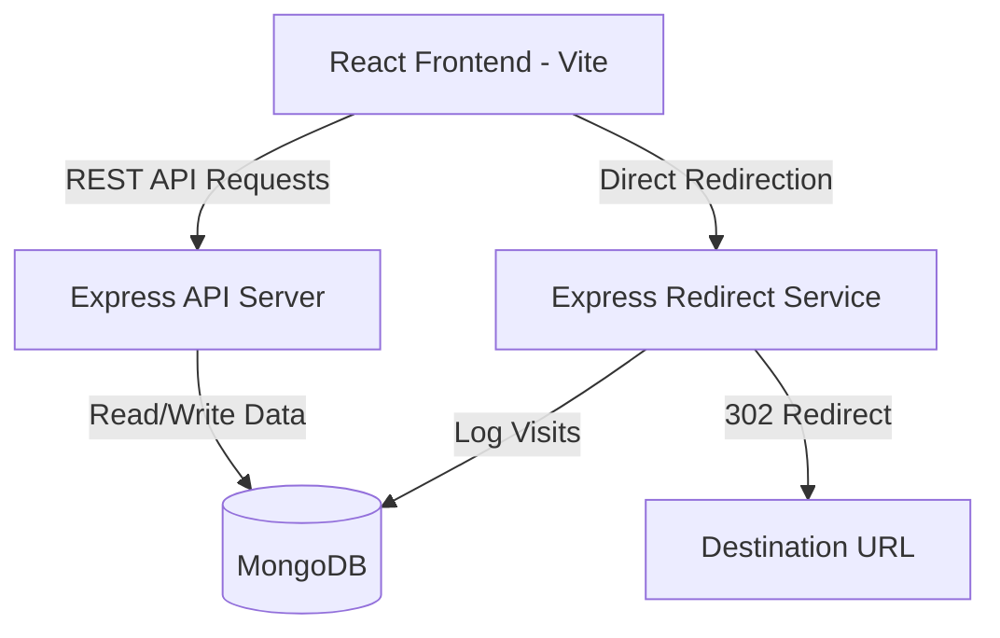

# URL Shortener with Analytics

A full-stack, responsive URL Shortener application that enables authenticated users to create, manage, and analyze shortened URLs. The platform provides real-time click tracking, visit history, and rich visual analytics (by browser, OS, device, and referrer) through a premium glassmorphic dashboard.

---

## Architecture & Data Flow

### Conceptual Architecture
```text
┌──────────────┐
│     User     │
└──────┬───────┘
       │
       ▼
┌──────────────┐
│ React (Vite) │
└──────┬───────┘
       │ REST APIs (Native Fetch)
       ▼
┌──────────────┐
│ Express API  │
└──────┬───────┘
       │
       ▼
┌──────────────┐
│   MongoDB    │
└──────────────┘
```

### System Architecture Diagram


* **Short URL Redirection**: `User Visit` → `Express Redirect Service (/r/:shortCode)` → `Log Visit Analytics` → `Redirection to Original URL`
* **Analytics Aggregation**: `MongoDB VisitAnalytics Collection` → `Express Aggregation Pipeline` → `Recharts Visual Charts`

---

## Features

### 🔐 Authentication & Security
* **User Registration & Login**: Multi-screen auth system.
* **Password Hashing**: Secure storage using `bcryptjs`.
* **JWT-based Authentication**: Secured routes and stateful session management.
* **Private Route Protection**: Dashboard and analytics routes are protected from unauthorized visitors.

### 🔗 URL Shortening & Customization
* **Short Code Generation**: Automatically generates a unique, collision-resistant 7-character code.
* **Custom Aliases**: Users can supply a custom slug (e.g. `/r/my-link`) instead of a random string.
* **Destination Validation**: Rigorous server-side URL validation before database persistence.
* **Link Expiration Support**: Optional expiration date/time setting for shortened links. Once expired, links return a standard `410 Gone` HTTP status.
* **Title & Description Editing**: Custom labels and notes for organized link management.

### 📂 Unified Dashboard & Copy-Paste Utility
* **Link Management**: A grid interface to search, filter, and sort links (by Date Created or Click Count).
* **Instant Clipboard Copy**: One-click sharing with real-time copy confirmation.
* **Dynamic QR Codes**: Generates high-quality QR codes for every link, downloadable directly as **SVG** or **PNG** for print/digital distribution.
* **Link Deletion**: Permanent removal of links and all their associated analytical logs.

### 📊 Real-Time Analytics Dashboard
* **Total & Unique Clicks**: Compares raw click counts against unique users (calculated via IP address, OS, and browser combination).
* **Click Timeline**: Visually traces click trends over time using interactive `Recharts` area graphs.
* **Demographic & Tech Breakdown**:
  * **Traffic Referrers**: Tracks where visitors originate (Direct, Google, Twitter, etc.).
  * **Browsers**: Chrome, Firefox, Safari, Edge, etc.
  * **Operating Systems**: Windows, macOS, Linux, Android, iOS.
  * **Devices**: Mobile, Tablet, Desktop.
* **Detailed Visit Log**: Lists details of the 30 most recent visits (including anonymized IP addresses and exact timestamps).

### ⚡ Advanced Features
* **Bulk URL Shortening**: Ability to paste a CSV-style list of URLs (Format: `url, [custom_alias], [optional_title]`) and shorten multiple links in a single request.
* **Local Network QR Sharing**: Resolves base URL to local network IP addresses, allowing mobile devices on the same Wi-Fi to scan and test generated QR codes.

---

## Tech Stack

### Frontend
* **Core Framework**: React.js (Vite-powered for rapid development and builds)
* **Routing**: React Router DOM (v6)
* **Charts & Data Viz**: Recharts
* **Icons**: Lucide React
* **Styling**: Vanilla CSS (Modern CSS variables, responsive grids, and glassmorphic designs)
* **QR Codes**: `qrcode.react`

### Backend
* **Runtime**: Node.js & Express.js
* **Database Driver**: Mongoose ODM
* **Authentication**: JSON Web Token (JWT) & `bcryptjs`
* **User-Agent Parsing**: `ua-parser-js`
* **Input Validation**: `validator`

### Database
* **Database**: MongoDB (Local or Atlas cloud cluster)
* **Collections**: `users`, `shorturls`, `visitanalytics`

---

## Setup Instructions

### Prerequisites
* **Node.js** (v18+)
* **MongoDB** (Running locally or a cloud database instance)

### Clone the Repository
```bash
git clone <repository-url>
cd url-shortener
```

### Environment Variables
Create a `.env` file in the `backend` directory. You can use the `backend/.env.example` file as a reference.

```env
PORT=5000
MONGODB_URI=mongodb://localhost:27017/url_shortener_db
JWT_SECRET=your_jwt_secret_key_here
BASE_URL=http://localhost:5000
```

---

## Execution Guide

The project includes a root-level workspace configuration that permits running the entire monorepo with single-line commands.

### Option A: Monorepo Commands (Recommended)

Run all steps directly from the project root folder:

1. **Install all dependencies** (Root, Backend, and Frontend):
   ```bash
   npm run install:all
   ```
2. **Start both Backend and Frontend servers concurrently**:
   ```bash
   npm run dev
   ```

### Option B: Manual Startup

Run the frontend and backend in separate terminal tabs:

#### 1. Backend Service
```bash
cd backend
npm install
npm run dev     # Starts backend on port 5000
```

#### 2. Frontend App
```bash
cd frontend
npm install
npm run dev     # Starts Vite dev server on port 5173
```

---

## Assumptions Made
1. **Local MongoDB Instance**: We assume a MongoDB instance is active on `mongodb://127.0.0.1:27017` locally, or configured properly via the `MONGODB_URI` environment variable.
2. **Standard User-Agent Headers**: The analytics dashboard parses device, OS, and browser parameters assuming standard, un-spoofed client HTTP headers.
3. **Local Subnetwork**: Testing QR codes on mobile devices via local host IP assumes the host computer and mobile devices are connected to the exact same Wi-Fi subnet.
4. **State Storage**: Authentication tokens (JWTs) are assumed to be stored in the browser's `localStorage` for maintaining secure sessions.

---

## AI Planning & Design Iteration Document
During the build and refinement phase, we followed a structured implementation cycle to deliver a production-ready application.

### 1. Database & Schema Modeling
* Formulated the database architecture to support relational references using MongoDB.
* Structured the `ShortURL` collection to hold metadata including creation/expiration date, labels, custom alias, and click count.
* Designed the `VisitAnalytics` schema to log atomic information for every redirect, including OS, Browser, Device Type, IP address, and Referrer domain.

### 2. API Design & Security
* Established robust middleware for validating target destination URLs.
* Built standard security checks: preventing collision of custom aliases, and returning a `410 Gone` status code if a shortened URL expires.
* Integrated bcrypt hashing for user registration/login, alongside JWT issuance for private routes.

### 3. Frontend Implementation & Visual Polishing
* Iterated on a high-end glassmorphic theme using clean HSL color tokens and custom CSS variables.
* Integrated Recharts visualization to convert complex visit metrics into interactive, user-friendly charts.

### 4. Critical UX Iterations (Fixes Made)
* **Contrast Alignment**: Identified and fixed a major styling bug where the shortened URL link and the click analytics results (Total, Unique, and Average daily clicks) were rendering in white (`#fff`) on a white container, making them invisible. Restyled them to use brand colors (`var(--accent-indigo)` and `var(--text-primary)`).
* **Tooltip Rendering**: Fixed an issue in Recharts data tooltips showing a black box with invisible text by overriding the default tooltip wrapper and setting explicit `itemStyle` and `labelStyle` parameters to enforce white-on-dark readability.

---

## Video Demonstration
[Click here to watch the walkthrough video on Loom / YouTube](https://www.loom.com/share/afe460dea12841a083c29f986eba045c)

---

This project is a part of a hackathon run by https://katomaran.com
